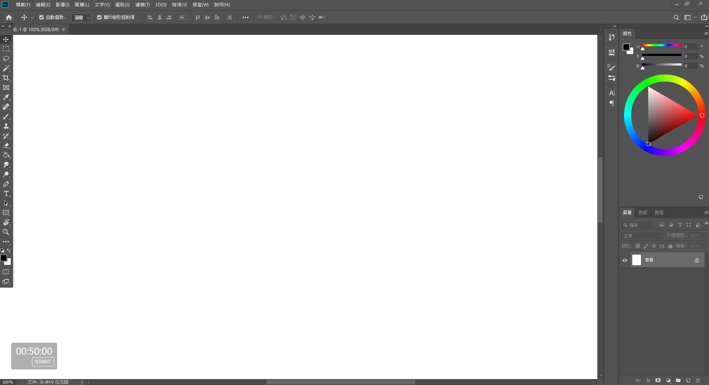
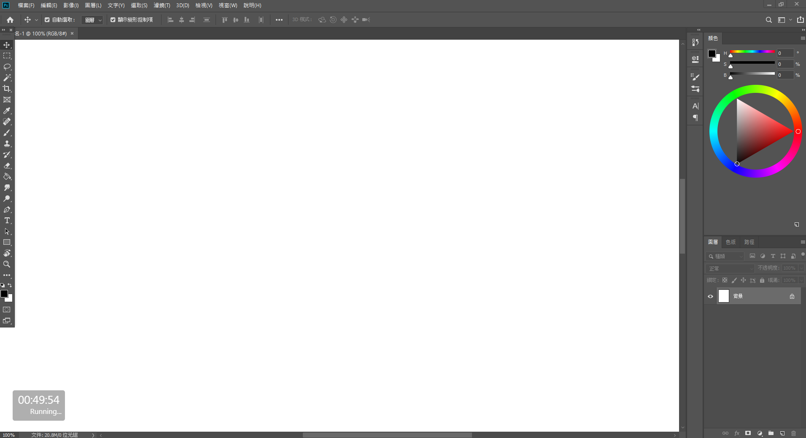

# Countdown
  

This is the countdown tool.  
The goal is to improve efficiency.  
Use Vue.

1.finish screenshot  
2.custom countdown second  
3.always window top  

### dev
```
npm i
npm start
```
### build
```
node bulid
```

### demo
  
  

